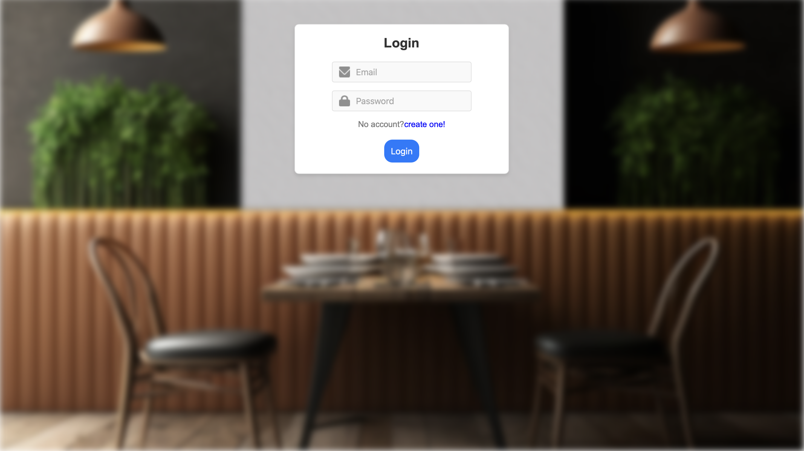
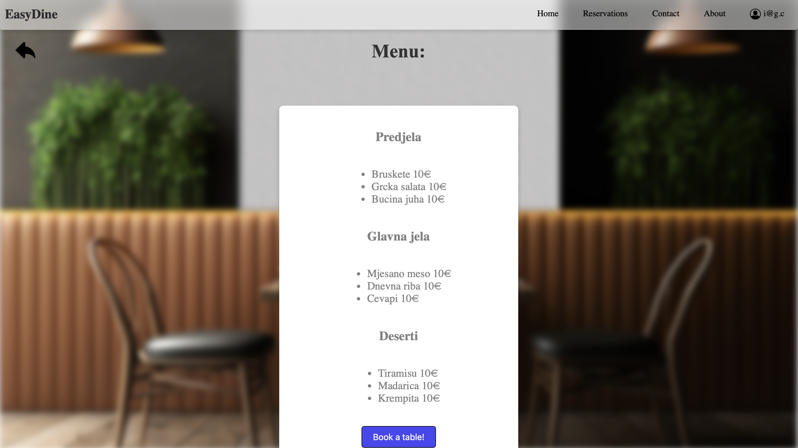
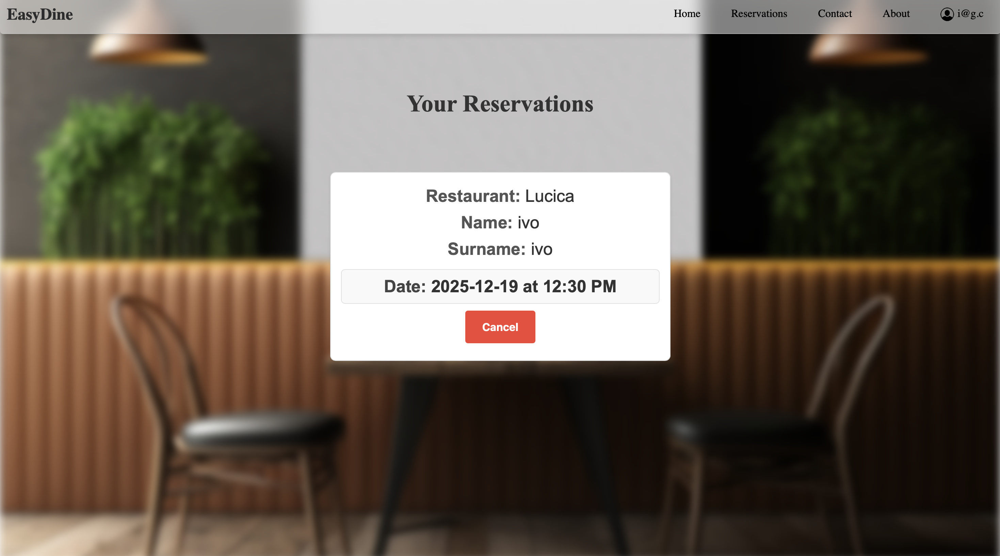

# 🍽️ EasyDine

EasyDine je moderna web aplikacija za pregled restorana i jednostavno online rezerviranje stolova.  
Kroz elegantno i intuitivno sučelje korisnici mogu pregledavati restorane, vidjeti jelovnik, odabrati datum, vrijeme i stol te ispuniti podatke za rezervaciju.

Aplikacija je razvijena u **Reactu (Vite)** uz korištenje modernog dizajna, jednostavne navigacije i glatkog korisničkog iskustva.

---

## 📸 Screenshots

### 🔐 **Login stranica**

### 🏘️ **Pregled restorana**

### 📋 **Jelovnik odabranog restorana**

### 🕒 **Odabir datuma, vremena i stola**

### 🧾 **Forma za unos podataka**

### ✅ **Pregled i potvrda rezervacija**

---

## ✨ Features

- 🔐 **Login sustav**  
- 🏠 **Pregled svih dostupnih restorana**
- 📋 **Prikaz jelovnika po kategorijama**
- 📅 **Odabir datuma i vremena**
- 🍽️ **Odabir dostupnog stola**
- 📝 **Unos osobnih podataka i obroka unaprijed**
- ✔️ **Prikaz potvrđenih rezervacija**
- ❌ **Otkazivanje rezervacije**
- 🎨 **Moderan, hotelski UI dizajn s blur efektima**
- 📱 **Potpuno responzivan dizajn**

---

## 🛠️ Tech Stack

- **React (Vite)**
- **JavaScript / JSX**
- **CSS** (custom styling)
- **React Router** za navigaciju
- **Local state management (useState, props)**

